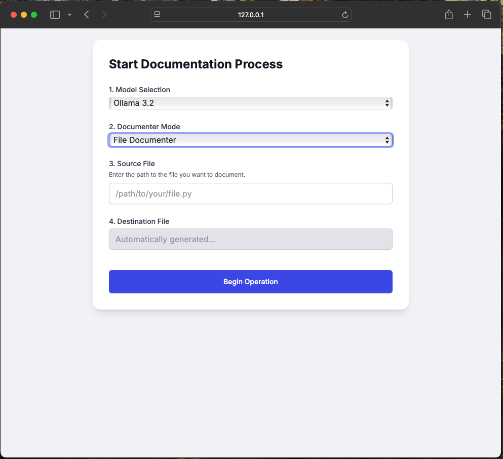

Simple web interface for user to input:
- source directory: The project you want documented,
- destination directory: The folder to create with documented code, and
- model selection: Choice between different LLM providers like OLLAMA, Open AI, etc.

to our Agent to generate documentation for their codebase.



### Setup

> Ensure that your terminal is pointed to the web-app root directory when running the CLI commands below.

Run the following command within the folder to setup the python ‘virtual environment’.
```bash
python3 -m venv .venv
```

From the same folder run the following command to activate the virtual environment.
```bash
source .venv/bin/activate
```

After activating the virtual environment use the python package manager (pip) to install all dependencies.
```bash
pip install -r requirements.txt
```

After installing `flask` run the application with the following command:
```bash
flask run
```

> By default flask will publish the web-app to your local host in the following address: http://127.0.0.1:5000